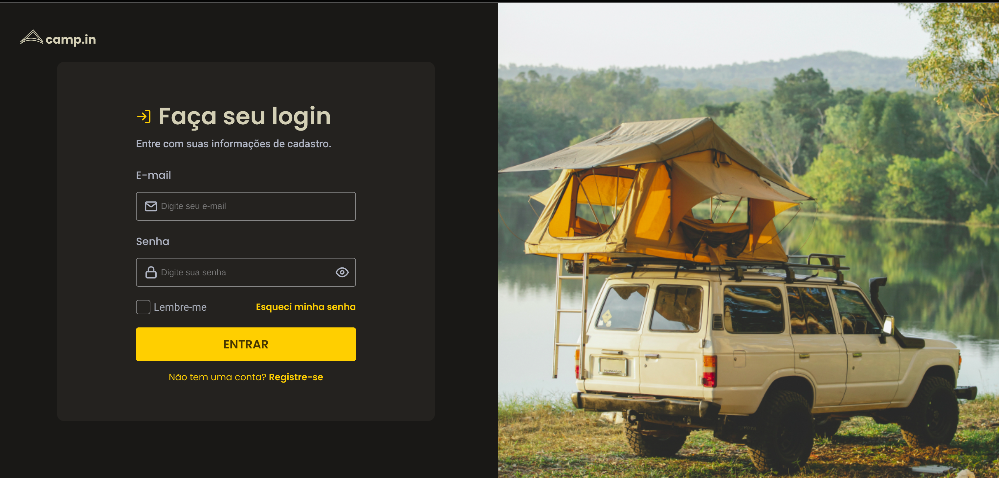
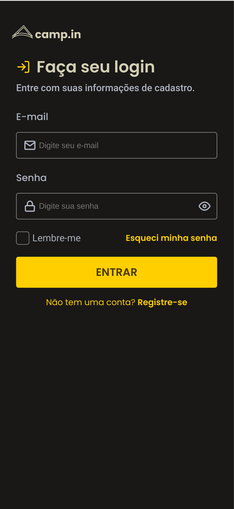

  <a href="#-tecnologias">Tecnologias</a>&nbsp;&nbsp;&nbsp;|&nbsp;&nbsp;&nbsp;
  <a href="#-projeto">Projeto</a>&nbsp;&nbsp;&nbsp;|&nbsp;&nbsp;&nbsp;
  <a href="#-layout">Layout</a>

 

 

### Desktop

  

 

### Mobile

  

## 🚀 Tecnologias

Esse projeto foi desenvolvido com as seguintes tecnologias:

- HTML
- CSS

Bibliotecas

- [Google Fonts](https://fonts.google.com/)

## 💻 Projeto

Desafio criado pela Rocketseat para desenvolver uma página com um formulário de login.

➡️ &nbsp;[Acesso ao desafio](https://efficient-sloth-d85.notion.site/Desafio-Login-Form-CSS-a10caea5a183494e97eb9ce4f33536b3)
 
➡️ &nbsp;[Acesso ao projeto](https://mariamorena27.github.io/login_form/)

---

## 🔖 Layout

Você pode visualizar o layout do projeto através [desse link](<https://www.figma.com/file/ARirlos8DvDazKI0A2cYM1/DD-%2F-Login-Form---CSS-(Copy)?node-id=216%3A3>). É necessário ter conta no [Figma](https://figma.com) para acessá-lo.

---

Feito com ♥ by Maria Morena!
